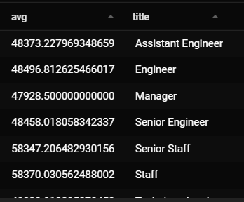

# Pewlett-Hackard-Analysis.
The purpose of this analysis is to prep for the up coming "Silver Tsunami" by finding those who will be retiring soon as well as though who are eleible to mentor in preporation to their retirement. 

## Results

* The senior engineers will have the most retining personel.
* The second most is the senior staff.
* There are 1549 eligable to be mentored.
* There are more retireing personal then those eligable to be mentored.  

## Summary
1) How many roles will need to be filled as the "silver tsunami" begins to make an impact?
The is going to need to be at most 72,458 roles that will need to be filled.
2) Are there enough qualified, retirement-ready employees in the departments to mentor the next generation of Pewlett Hackard employees?
Yes, there are 48 retirement-ready employees for each eligable mentee.

## Futher Queries

In order to prepare financially for taking on new employees I have created two new queries to filter down the average salaries of those that are retiring. The two new tables have been exported with the name "retiring_avg_by_title.csv" and "retiring_salary.csv".

